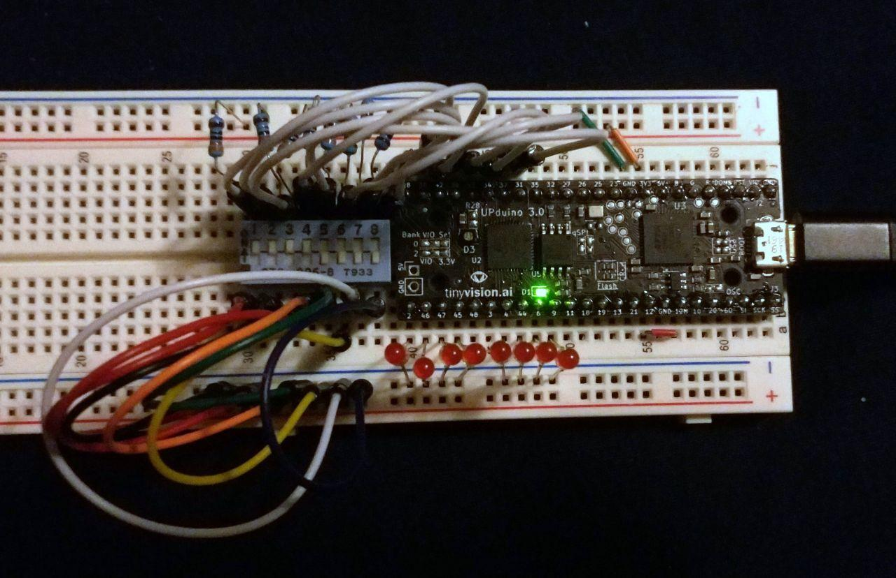
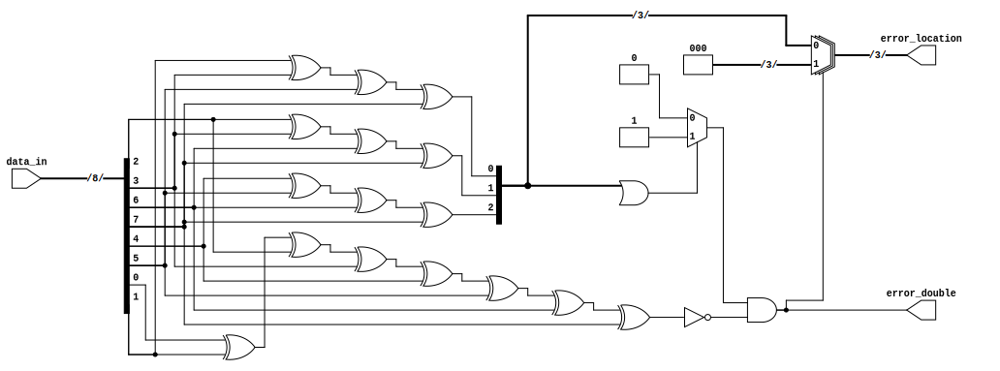
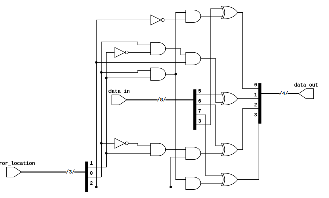

## hamming

A simple hamming(8,4) implementation

- hamming_set - Takes in 4 bits of data and gives a proper 8-bit hamming code. Was by running through each combination of 4 bits and checking the output. While initially testing, I found that I had accidentally swapped P2 and D1, thus I was getting incorrect outputs.

- hamming_detect - Takes in an 8-bit hamming code and gives back either the error location (if there's one error) or if there was a double error (in which it will set error location to zero). Was tested by starting with a known good hamming code and changing one bit at a time to verify a correct output.

- hamming_correct - Takes in an 8-bit hamming code and error location and corrects it, giving back the original 4 bits of data. Was tested by hard setting a hamming code and error location, then looking at the data output to make sure it was correct.

Thank you to 3blue1brown and Ben Eater's videos on this topic, as they were the resources I used to implement this project:
- 3blue1brown: https://www.youtube.com/watch?v=X8jsijhllIA, https://www.youtube.com/watch?v=b3NxrZOu_CE
- Ben Eater: https://www.youtube.com/watch?v=h0jloehRKas
