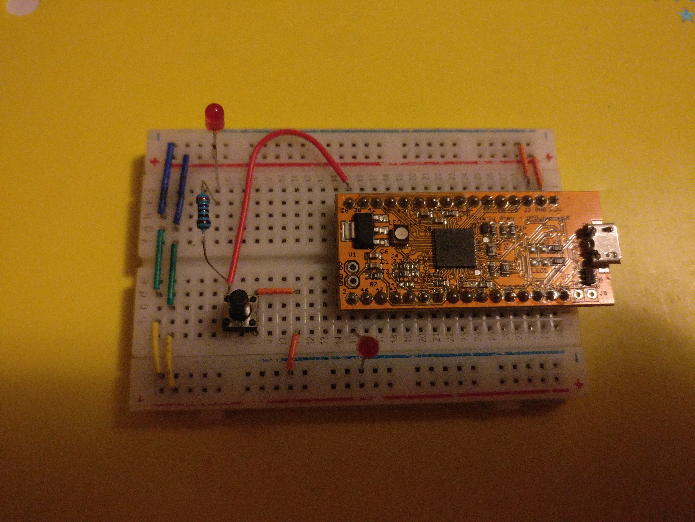

## inout LED and Button

This project flashes the built-in LED of the Upduino, as well as turns on a separate LED if a button is pressed on the same line as the first. It offers the ability to use 1 pin to send and received information for debugging instead of having to use two.

Currently when the button is pressed there is no way to turn on and off the left most LED. I am looking into ways to bypass this.

Never drive the GPIO pin that has both the button and LED high as it will cause a short circuit whenever the button is pressed.

Credit to this [stackoverflow post](https://electronics.stackexchange.com/a/264208) for how the circuit would work.

