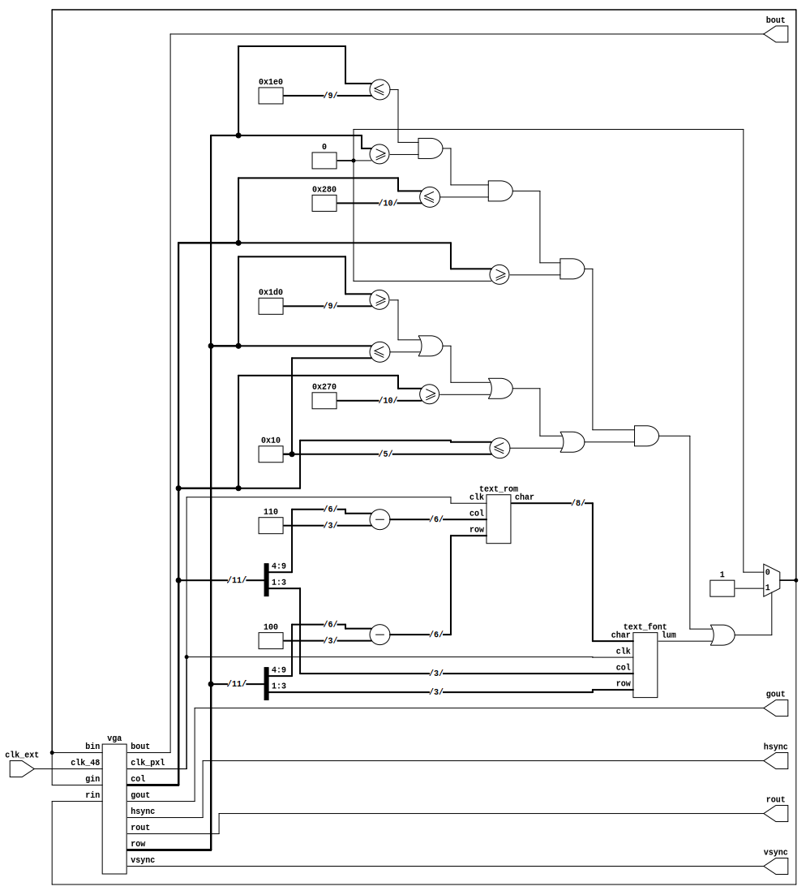

## vga_text

An ASCII character set with C64 font and text buffer that outputs to a 768p VGA display. Using too many characters causes weird artifacts, unsure why. Only has A-Z currently mapped. Need to redo text buffer using the device RAM directly as I believe this is what's causing the problems.




```
Info: Device utilisation:
Info: 	         ICESTORM_LC:   936/ 5280    17%
Info: 	        ICESTORM_RAM:     0/   30     0%
Info: 	               SB_IO:     5/   96     5%
Info: 	               SB_GB:     4/    8    50%
Info: 	        ICESTORM_PLL:     1/    1   100%
Info: 	         SB_WARMBOOT:     0/    1     0%
Info: 	        ICESTORM_DSP:     0/    8     0%
Info: 	      ICESTORM_HFOSC:     1/    1   100%
Info: 	      ICESTORM_LFOSC:     0/    1     0%
Info: 	              SB_I2C:     0/    2     0%
Info: 	              SB_SPI:     0/    2     0%
Info: 	              IO_I3C:     0/    2     0%
Info: 	         SB_LEDDA_IP:     0/    1     0%
Info: 	         SB_RGBA_DRV:     0/    1     0%
Info: 	      ICESTORM_SPRAM:     0/    4     0%

```
